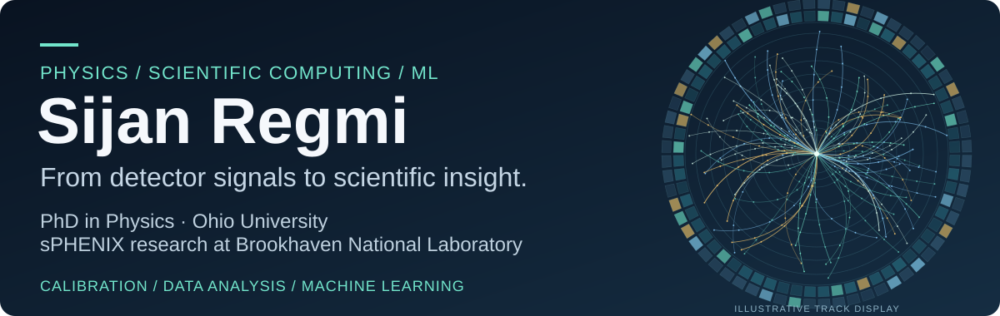
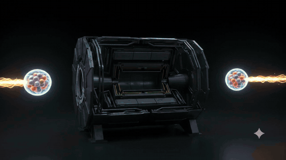
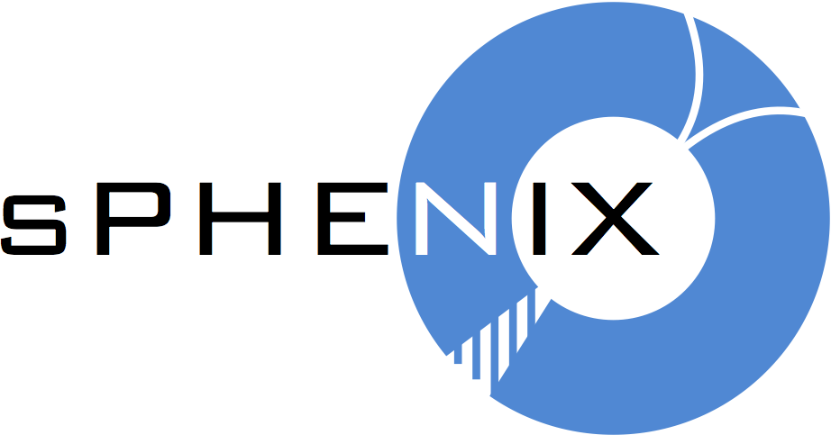
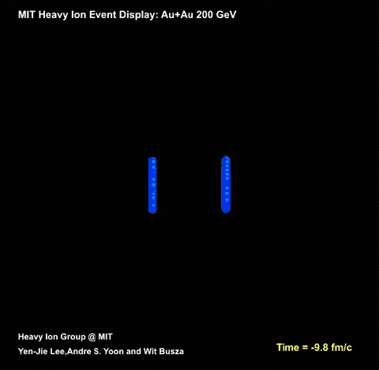

  

  
   Artistic collision visualization · Not experimental data.

<h2 align="center">
  <a href="https://www.linkedin.com/in/regmi-sijan/">LinkedIn</a>
  &nbsp; · &nbsp;
  <a href="https://orcid.org/0000-0003-2620-2578">ORCID &amp; publications</a>
  &nbsp; · &nbsp;
  <a href="https://github.com/regmi-sijan/CaloHistViewer">CaloHistViewer</a>
</h2>

## Physics questions. Reproducible code.

   
  Research with the sPHENIX Collaboration · RHIC · Brookhaven National Laboratory 
  Logo credit: <a href="https://www.sphenix.bnl.gov/logo">sPHENIX Collaboration</a>.

I'm **Sijan**, a PhD physicist working at the intersection of **experimental particle physics, scientific computing, and machine learning**. My research with the **sPHENIX Collaboration at Brookhaven National Laboratory** focused on electromagnetic calorimeter calibration and neutral-pion and eta-meson measurements.

I build tools that turn complex experimental data into interpretable results—from detector diagnostics and statistical analysis to supervised signal/background classification.

  

## What I work on

| Detector physics | Scientific software | Machine learning |
| :--- | :--- | :--- |
| Electromagnetic calorimetry, detector calibration, and performance studies | Reusable analysis workflows, interactive diagnostics, and reproducible data processing | Supervised classification and signal/background separation |
| Neutral-meson reconstruction and signal extraction | Python, C++, ROOT, shell scripting, and Git | Statistical validation and uncertainty quantification |

## Featured project · CaloHistViewer

**See the detector, one channel at a time.**

A Python GUI for visualizing and inspecting per-tower electromagnetic calorimeter histograms. Built to support sPHENIX detector calibration, diagnostics, and monitoring.

**Python · Scientific visualization · Detector diagnostics**

[Explore CaloHistViewer →](https://github.com/regmi-sijan/CaloHistViewer)

## Heavy-ion collisions in motion

  

**From colliding nuclei to an expanding particle system.** This illustrative HIJING-based event visualization shows a gold–gold collision and its evolution. Blue denotes the nuclei, red the modeled quark–gluon medium, light blue baryons, and gray mesons. It is an educational visualization, not sPHENIX collision data.

**Animation credit:** Heavy Ion Group at MIT — Yen-Jie Lee, Andre S. Yoon, and Wit Busza. [Original animation and modeling assumptions, hosted by PHOBOS/BNL](https://www.sdcc.bnl.gov/phobos/Animations/index.htm) · [Original video](https://www.sdcc.bnl.gov/phobos/Animations/zx_jan122008.mpg). Converted to a resized, looping GIF; original on-screen credits retained.

**Why jets?** Energetic quarks and gluons traverse the QGP and emerge as sprays of particles. Measuring how those jets are modified helps probe the medium. [Learn about sPHENIX's jet and heavy-flavor program →](https://www.bnl.gov/rhic/sphenix.php)

## Research highlights

- **EMCal calibration:** Used neutral-pion decays to calibrate the sPHENIX electromagnetic calorimeter and validate its energy scale.
- **Neutral-meson physics:** Studied pion and eta production in proton–proton collisions, including efficiency studies and background reconstruction.
- **ML for reconstruction:** Developed a supervised classification framework for signal/background separation in eta-meson reconstruction.
- **Research software:** Developed CaloHistViewer to make per-channel detector data easier to inspect and interpret.

<strong>Selected publications</strong>

 

Co-author as a member of the **sPHENIX Collaboration**:

- **Measurement of charged hadron multiplicity in Au+Au collisions at √sNN = 200 GeV with the sPHENIX detector**  
  *Journal of High Energy Physics* (2025). [Read the paper](https://doi.org/10.1007/JHEP08(2025)075)
- **Measurement of the transverse energy density in Au+Au collisions at √sNN = 200 GeV with the sPHENIX detector**  
  *Physical Review C* **112**, 024908 (2025). [Read the paper](https://doi.org/10.1103/h8d5-swg6)

<strong>Background & community</strong>

 

- **PhD in Physics**, Ohio University, 2026 — experimental high-energy physics.
- **MS in Physics**, Ohio University, 2022; **MS in Physics**, Tribhuvan University, 2018.
- Undergraduate physics laboratory instruction, mentoring, and graduate mathematical physics grading.
- Manuscript peer review, research-grant review, and STEM outreach.
- **GradImpact Recognition** (2026) and **Vishwa S. Shukla Memorial Tribute Award** (2025), Ohio University.

---

  <strong>Interested in scientific software, detector physics, or ML for research?</strong> 
  <a href="https://www.linkedin.com/in/regmi-sijan/">Let's connect on LinkedIn.</a>

<!-- Visual assets: original banner and toolkit layout. Python, C++, and Git icons from Simple Icons (https://simpleicons.org/), CC0. Brand marks belong to their respective owners. -->

